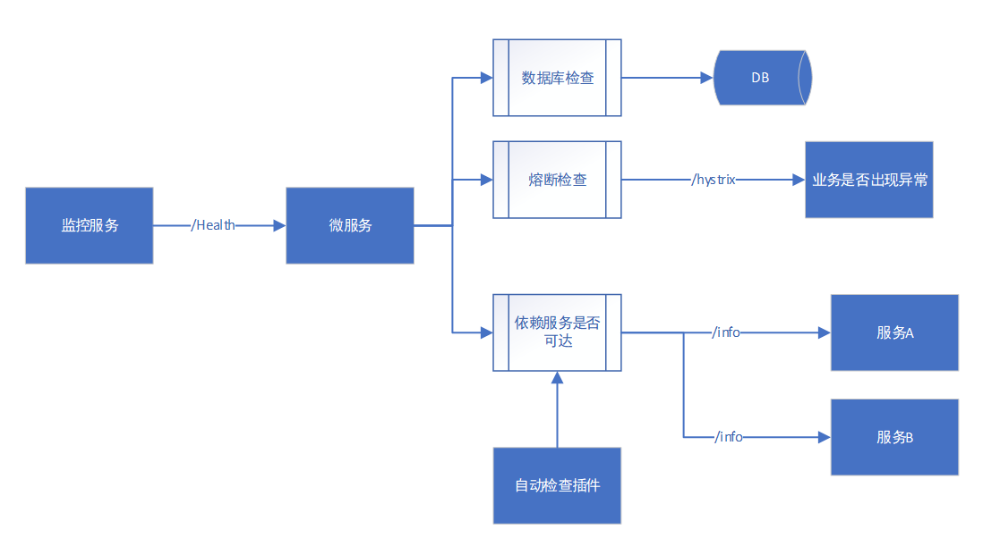
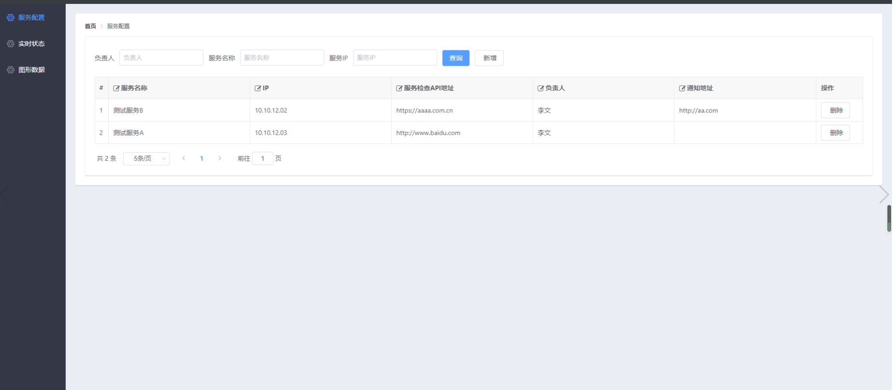
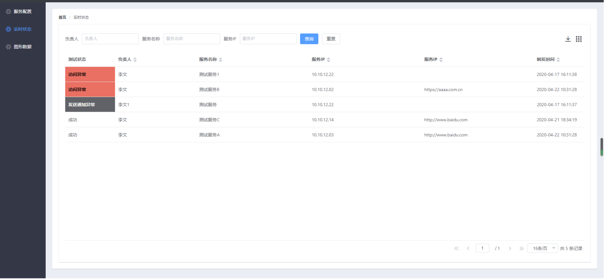
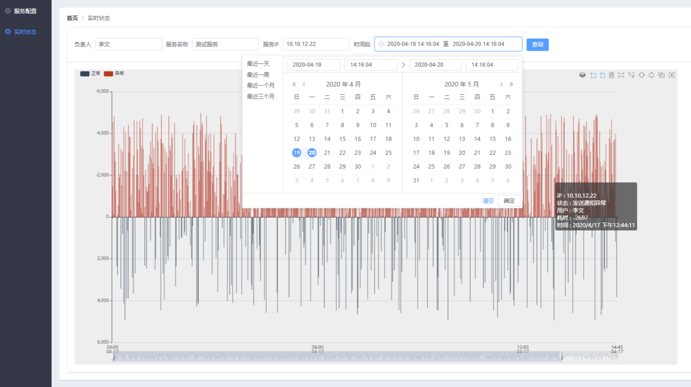
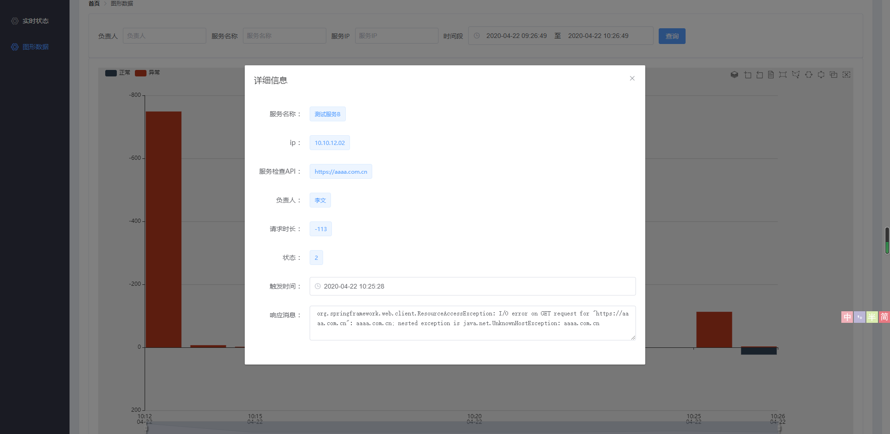

### 目标
	
	1. 当服务出现，无法被访问、数据库连接不上、调用相关依赖的服务访问不通的问题时候，可以及时的报警通知。并且，有数据记录用于定位回溯问题点。

### 可以做到什么
	
	1. 我的服务是否可以被他人访问通。（服务是否可达）
	2. 服务连接的数据库是否是正常。（数据库是否正常）
	3. 我的服务需要调用的其他服务是否也是正常的。（依赖是否可达）

### 如何做到

~~~
说明：
	1.  spring boot actuator 框架 自身提供 /health 服务健康状态API。每次访问这个API ，都会触发实现了它接口功能的所以方法。 
	2. 数据库是否可以正常访问，执行语句。  actuator  自己已经集成。
	3. 业务是否出现异常
		a. 微服务都是通过暴露自身API 来提供业务功能支持的
		b. 基于上述原理，我们可以得到，暴露出去的功能接口出现了异常，那么该接口对应的业务功能就出现了异常。
		c. actuator  自己已经集成 hystrix  ，只要做好接口熔断设置，当调用actuator/health API的时候就可以获取到业务是否异常。
	4. 相关依赖服务是否可达，提供一个spring boot 插件 maven ，找个插件实现 actuator/health 接口，获取所有代理访问 bean，拿到当前服务的所有依赖服务，访问依赖服务的/info 节点，验证是否可达。
~~~
### 预警
~~~
	1. 以每分钟的频率访问注册过服务/health 节点。判断与解析响应信息，异常触发企业微信通知。
~~~
### 状态描述
 1 down 2 访问异常 3 发送通知异常  4 成功
```
1. down ： /health 返回数据为down。显示返回结果（数据库异常信息，熔断异常信息，关联微服务异常信息）
2. 访问异常 ：访问服务监控API调用报错。显示报错信息
3. 发送通知异常 ： 异常通知消息发送失败。 
4. 成功 ： 微服务运行正常。
```
### 可视化

1. 服务注册页面管理

2. 服务状态信息展示

3. 服务历史状态数据图形化展示



### 体验地址 
	1. http://39.101.204.94:11201

### 为什么需要手动配置？
1. 兼容非Spring boot 项目
2. 现实情况，从注册中心拿到的有一部分是无法访问的不正确地址。（没有基本规范！！！）
